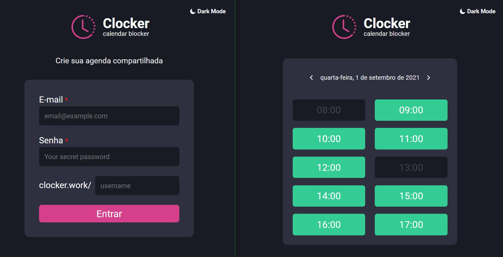

## 🕑 Clocker

Este projeto abrange a parte de front end de um sistema de agenda compartilhada, onde você consegue reservar vários horários de atendimento de determinado dia. E para manter  mais organizado, o usuário deve fazer Login.

## 🖼️ Layout

[Figma](https://www.figma.com/embed?embed_host=notion&url=https%3A%2F%2Fwww.figma.com%2Ffile%2FiNd3IjUz1Kecf5ykabGdxM%2FClocker_%3Fnode-id%3D0%253A1)

<p align="center">
  
</p>

## 🚀 Tecnologias

- [React](https://reactjs.org/)
- [TypeScript](https://www.typescriptlang.org/)
- [Styled Components](https://styled-components.com/)
- [NextJs](https://nextjs.org/)
- [react-icons](https://react-icons.github.io/react-icons/)
- [date-fns](https://date-fns.org/)
- [cookies](https://github.com/maticzav/nookies)

## :wrench: Instalação

```bash
# Open a terminal and copy this repository with the command
git clone https://github.com/evertonvargas/Clocker
# or use the download option.

# Install dependencies
npm i

# Start application
npm run dev

# Go to http://localhost:3000
```
